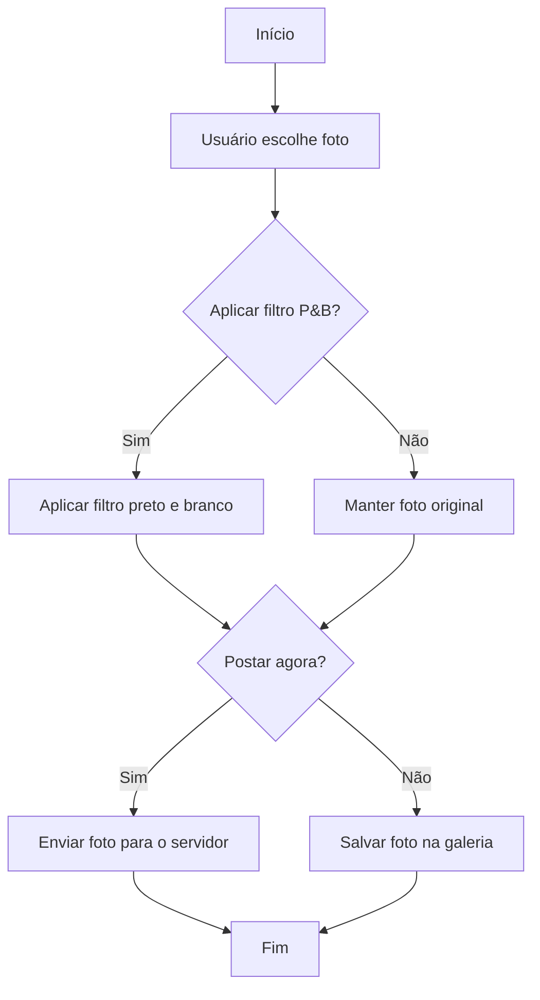

# Algoritmo – Sensor de Ré de Veículo

## Descrição

Este algoritmo simula o funcionamento de um sensor de ré automotivo.
O sistema recebe a distância entre o veículo e um obstáculo e,
com base nesse valor, informa o nível de alerta ao motorista.

Se a distância for grande, o sistema indica que o veículo está seguro.
À medida que a distância diminui, o sistema aumenta o nível de alerta,
simulando o comportamento de sensores de estacionamento presentes em veículos modernos.

#Fluxograma 

```mermaid
flowchart TD

A[Início] --> B[Ler distancia_obstaculo]

B --> C{distancia_obstaculo <= 0.5?}

C -- Sim --> D[Emitir alerta sonoro]
D --> E[Mostrar "PARE"]

C -- Não --> F[Mostrar "sem som"]

E --> G[Fim]
F --> G
```

#Agoritmo - Filtro de Foto

## Descrição

Este algoritmo simula o funcionamento de um filtro de foto.
O usuário escolhe uma imagem, decide se deseja aplicar filtro
preto e branco e depois escolhe se deseja postar a foto
imediatamente ou salvá-la na galeria.

 ##Fluxograma 



# Algoritmo – Simulação de Saque em Caixa Eletrônico

## Descrição

Este algoritmo simula uma operação de saque em um caixa eletrônico.
O sistema possui um saldo disponível e solicita ao usuário o valor
que deseja sacar.

Se o saldo for suficiente, o valor do saque é debitado da conta e
o sistema informa o novo saldo. Caso contrário, o sistema exibe
uma mensagem informando que o saldo é insuficiente para realizar
a operação.

#Fluxograma

```mermaid
flowchart TD

A[Início] --> B[Ler saldo_disponivel]
B --> C[Ler valor_saque]
C --> D{valor_saque <= saldo_disponivel?}

D -- Sim --> E[Atualizar saldo]
E --> F[Entregar notas]

D -- Não --> G[Mostrar "Saldo insuficiente"]

F --> H[Fim]
G --> H
```


